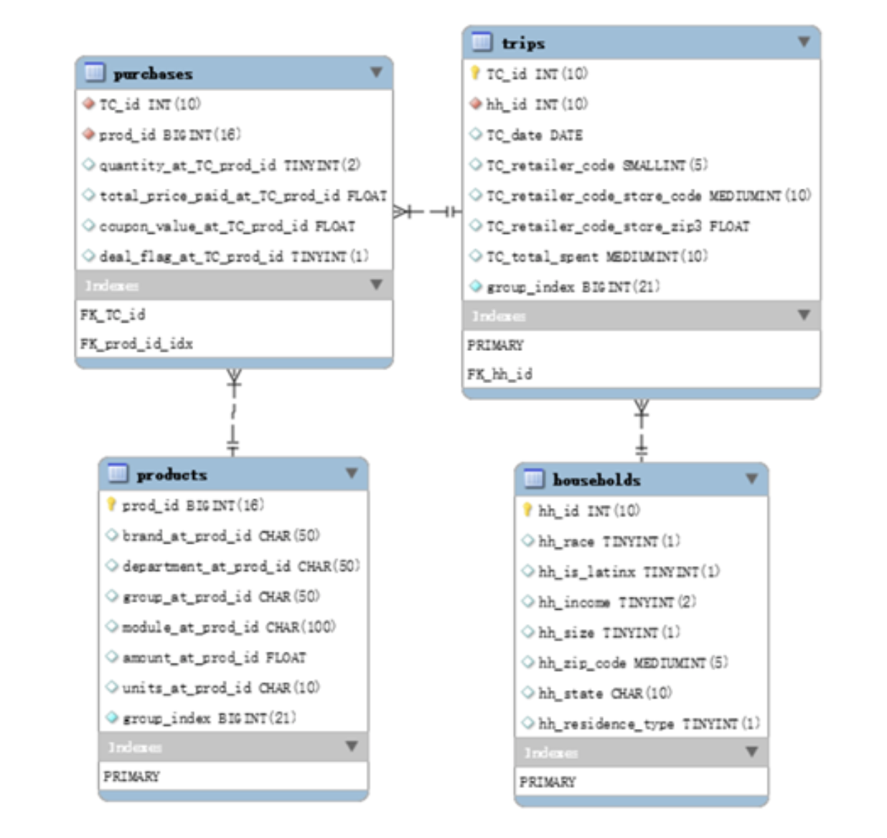

# Grocery Shopping Behavior Analysis with MySQL
## Introduction
There are two parts in this analytical project. First, I designed the schema and created a database with 4 tables and 50+ million observations. In the second part, I analyzed shoppers' behavior patterns and market opportunities for private-label products by using MySQL queries and visualized the results with Python.

## Part 1 Creating the Database
- Import Data
- Create Database

### Import data from CSV files into MySQL database
The data sets are too large to be loaded into MySQL database directly using tools provided by MySQL. Thus, I used Python to divide big data set into small parts and loaded them separately. Python’s module pandas provides a tool to read big CSV files by chunks instead of loading all information into memory at one time. Another module sqlalchemy allows creating an engine that can be used to create a live MySQL connection and load data stored in pandas dataframe into MySQL database. With the combination of these modules, I can firstly read a small part of a big CSV file, then conducted some cleaning works and finally loaded the formatted data into database. Repeated this process until all data is cleaned and imported into database. The Python script used for this part can be seen in Jupyter Notebook “ETL.ipynb”.

## Create a database schema
A well-designed schema can largely accelerate the speed of executing queries. I tried to build tables as restrict as I can, that is, using the least data type to store data. For those columns who are not set as the primary key but are likely to be frequently used in join syntax such as hh_id in the table trips, I reset them as index. The script used to create the schema can be viewed in SQL file “CREATE_SCHEMA.sql”. The visualized schema is shown below.

	
	

  <i>Schema</i> 

## Part 2. Consumer Behavior Analysis
In the database, there are **7,596,145** store shopping trips, **39,577** households, **863** different retailers, **26,402** different stores and **4,231,283** different products. For transactions, there are **38,587,942** records and **2,603,946** of them were realized under some kind of promotion.
The distributions of products and modules by departments can be seen as below.

	
	

  <i>Distribution of products and modules by Department</i> 

According to these bar charts, I find that the dry grocery has the most products and modules, and the magnet data has the least products and modules.
