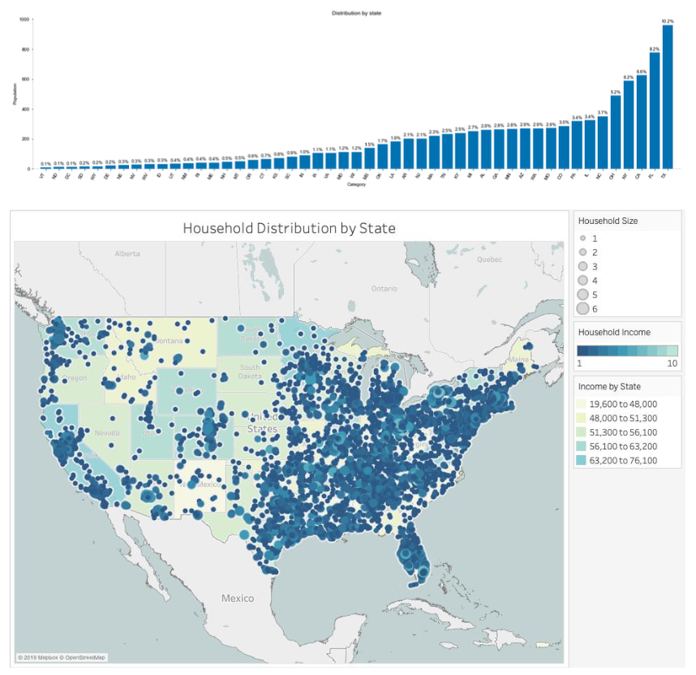

# Grocery Shopping Behavior Analysis with MySQL
## Introduction
There are two parts in this analytical project. First, I designed the schema and created a database with 4 tables and 50+ million observations. In the second part, I analyzed shoppers' behavior patterns and market opportunities for private-label products by using MySQL queries and visualized the results with Python and Tableau.

## Part 1 Creating the Database
- Import Data
- Create Database

### Import data from CSV files into MySQL database
The data sets are too large to be loaded into MySQL database directly using tools provided by MySQL. Thus, I used Python to divide big data set into small parts and loaded them separately. Python’s module pandas provides a tool to read big CSV files by chunks instead of loading all information into memory at one time. Another module sqlalchemy allows creating an engine that can be used to create a live MySQL connection and load data stored in pandas dataframe into MySQL database. With the combination of these modules, I can firstly read a small part of a big CSV file, then conducted some cleaning works and finally loaded the formatted data into database. Repeated this process until all data is cleaned and imported into database. The Python script used for this part can be seen in Jupyter Notebook “ETL.ipynb”.

### Create a database schema
A well-designed schema can largely accelerate the speed of executing queries. I tried to build tables as restrict as I can, that is, using the least data type to store data. For those columns who are not set as the primary key but are likely to be frequently used in join syntax such as hh_id in the table trips, I reset them as index. The script used to create the schema can be viewed in SQL file “CREATE_SCHEMA.sql”. The visualized schema is shown below.

	
	

  <i>Schema</i> 

## Part 2. Consumer Behavior Analysis
In the database, there are **7,596,145** store shopping trips, **39,577** households, **863** different retailers, **26,402** different stores and **4,231,283** different products. For transactions, there are **38,587,942** records and **2,603,946** of them were realized under some kind of promotion.
The distributions of products and modules by departments can be seen as below.

	
	

  <i>Distribution of products and modules by Department</i> 

According to these bar charts, I find that the dry grocery has the most products and modules, and the magnet data has the least products and modules.

### How many households do not shop at least once on a 3 month periods
I used two ways to calculate the number of households that do not shop at least once on a three-month period.
Firstly, I grouped all data into month level and found households that has at least a three-month gap between two continuous records. We found that 1,197 households do not shop at least once on a three-month period.
The first way is simple and fast while allows more bias in the result. To be more accurate, we also computed the answer on date level, and surprisingly found out that only 48 households meet the criteria. Thus, I concluded that using date level might be a more appropriate method than using month level.
In a real case, this situation may not be reasonable since it is less likely that a household can survive without shopping in a three-month period. However, it may be some recording errors that affect the result. To be more specific, imagine how these records are documented, it highly possible that a certain group of people were asked to record every single in-store purchase. Since there is no way to examine the validity and accuracy of the data, the problem of recording errors and bias might occur.

### Loyalism - Among the households who shop at least once a month, which % of them concentrate at least 80% of their grocery expenditure (on average) on single retailer?
To better understand the loyalty program, I computed the exact wallet share of all the retailers only to find out which household’s wallet share is usually occupied by one retailer.
The table below shows the total number of households in terms of loyalism. The x-axis denotes the wallet share from 50% to 80%. The y-axis denotes the time period from 6 months to 12 months in the same year

	
	

  <i>wallet_share</i> 

If following the definition of loyalism that keeps 80% wallet for 12 months, we will only find 124 households are loyalists, accounting for 0.31% of the population. The result is indeed hard for further analysis. Thus, we experimented with different matrices and found if we would loosen the standard of loyalism to 50% wallet share and 6 months in terms of time period, we can have 9,452 households that account for 23.88% of the population, which, in this case, makes more sense. We will take this new standard in the following analysis.

If considering loyalism among 2 retailers and following the definition of loyalism that keeps 80% wallet for 12 months, we will only find 204 households are loyalists, accounting for 0.52% of the population. However, if we follow our new standard, we can have 19,658 households that account for 49.67% of the population.

When looking at the demographic features, we see that the majority of households recorded live in the east of the US and there is remarkable households density in the southeast. Texas household number is the largest, taking up 10.2% of the data entries. The statistics of California is also significant, ranked third place among the country and first place in the west.

	
	

#### Average number of shopping trips per month
Average number of shopping trips per month slightly varies. It witnesses a peak value in December which is 17.6 trips. One possible reason can be that households tend to buy more groceries and gifts for Christmas and New Year.

	
	

#### Average number of days between 2 consecutive shopping trips

	
	

In terms of shopping frequency, most of the households shop in every 1-5 days. The distribution has a right tail, with a few households go for another shopping after more than 10 days.

### Correlation
#### Correlation between Trips and Item Purchased

	
	

The average number of shopping trips per month has a somewhat positive correlation with the average number of items purchased, but they are not strongly correlated with each other. We still need more data, such as the past three years’ data, to clarify the relationship between them. From the graph, except the case in December, as the average number of trips goes up, the average number of items purchased would increase. To be more specific, people are more likely to make impulsive purchases as shopping trip progresses. The higher the frequency we go to supermarkets per month, to some degree, it not only implies the more time we take browsing in the store in total but also the higher possibility that people will come up with new unplanned selections. Hence, we conclude that the more significant number of shopping trips per month would boost the average number of items purchased. As for the special case in December, our best guess is that because of the Christmas holiday, people are less willing to go shopping, but once they go shopping, they purchase more items than usual during the trip.

#### Correlation between average price and Item Purchased

	
	

There two things I would like to clarify before interpreting the graph. Firstly, numerous data points lie in the bottom-left corner of the graph, which suggests either the measure errors or the appearance of window shoppers (people who go to a store and, instead of buying stuff, they just browsed around). Secondly, to better look into the behavior patterns, we decide to exclude the outliers, which are not only misleading but make little sense.

From the graph, in general, we can see that there’s a negative nonlinear correlation between the number of items purchased and the average price paid per item. In this scatter plot, when the number of items purchased is relatively high, the cluster of these data stays in low ‘average price paid per item’ area. In contrast, when the amount of ‘average price paid per item’ becomes higher, the number of items purchased can be extremely low, can be approximated to 0. This result actually meets the law of demand, which is an economic principle that explains the negative correlation between the price of a good or service and its demand. When the price of one item becomes extremely high, people would tend to buy less, since the budget is relatively the same.
 
### Opportunities for Private-labeled products
#### Categories that have proven to be more “Private labelled”
We can observe from the graph above that `DELI` is the category that has the highest percentage of private- label products. On the other hand, the category of `ALCOHOLIC BEVERAGE` has the lowest percentage of private-label products.

#### A glance at expenditure share in Private Labeled products

	
	

We can find that the expenditure share in Private Labeled products does not fluctuate much across months. In addition, the most considerable difference between the highest month and the lowest month is 1.2%, which is subtle and ignorable in the case.

### Insights
**People with less financial advantage are more likely to purchase private-label products.**

	
	

The graph clearly suggests that there is a vast difference in terms of shopping patterns across three income groups. People belonging to the high-income group tend not to purchase private-label products. On the contrary, people in the low-income group favor private-label products when shopping.
But why so? There are two possible reasons for this phenomenon. At first glance, the quality of private-label products seems not making any income group stand out from others. However, further research reveals that private-label products tend to be much cheaper than their major competitors, thus are more appealing to people with low income. Secondly, consumers are more inclined to purchase products based on familiarity. For instance, Whole Foods Market is one of the best-known supermarkets in the US. Just as the case with other giants in the retail industry, It has its own private label line, 365 EVERYDAY VALUE, which sells both natural and organic selections at a competitive price. In other words, people have faith in the quality of products offered by Whole Foods Market. When the product line of 365 EVERYDAY VALUE comes out, people with less income, who often have a tight budget and are more sensitive to price, are able to purchase organic groceries at an affordable price with a trustworthy brand.

